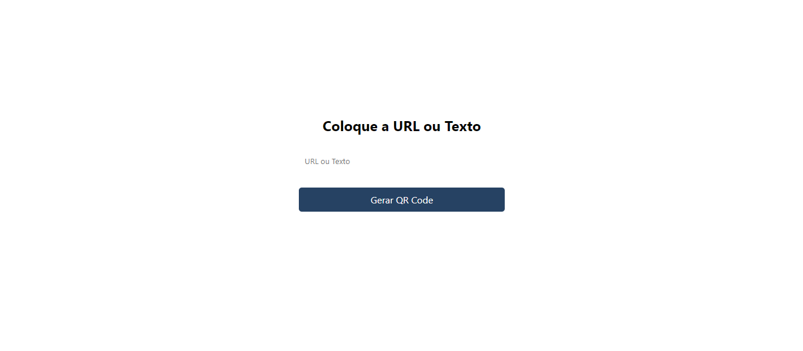

<h1 align="center">Gerador de QR Code</h1>

Usando os conhecimentos de HTML, CSS e Javascript, fui capaz de desenvolver esse app que consome uma API externa para gerar um QR Code para o usuário

 

  

 
